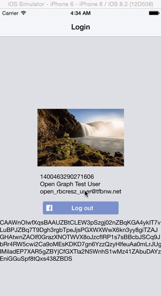

# React Native : Facebook SDK Login Button
`<FBLogin />` provides a [React Native][react-native] component wrapping the native [Facebook SDK login button](fb-sdk-loginbutton) and [manager](fb-sdk-loginmanager).



## Usage
```js
var FBLogin = require('react-native-facebook-login');

var Login = React.createClass({
  render: function() {
    return (
      <FBLogin style={{ marginBottom: 10, }}
        permissions={["email","user_friends"]}
        onLogin={function(){
          console.log("Logged in!");
        }}
        onLogout={function(){
          console.log("Logged out.");
        }}
      />
    );
  }
});
```

## Setup
```sh
npm install --save react-native-facebook-login
```
- Run ```open node_modules/react-native-facebook-login```
- Drag `RCTFBLogin.xcodeproj` into your `Libraries` group
- Select your main project in the navigator to bring up settings
- Under `Build Phases` expands the `Link Binary With Libraries` header
- Scroll down and click the `+`
- Find and add `libRTCFBLogin.a`
- ⌘+R and enjoy!

**Note**: While the RCTFBLogin project contains references to the necessary Facebook SDK frameworks. You will still need to ensure you have setup the Facebook SDK for use with your app. See the [example/toy.xcodeproj](example/toy.xcodeproj) project for an example or follow the instructions from the [Facebook quick start guide](https://developers.facebook.com/docs/ios/getting-started#).

### FBLogin
TODO: Document the props, expected values (FB SDK links), etc.

### FBLoginManager
Wraps features of the native iOS Facebook SDK `FBSDKLoginManager` interface. Provides interaction through callback functions and firing events which can be observed through the `RCTDeviceEventEmitter.addListener` method.

See [example/components/facebook/FBLoginMock.js](example/components/facebook/FBLoginMock.js) for an example using only the exposed native methods of the FBLoginManager to recreate the native `FBSDKLoginButton`.

### FBLoginManager.Events
A variety of events are emitted across the React Native bridge back to your javascript components. This means you can take advantage of the `RCTDeviceEventEmitter.addListener` method to listen, and create subscribers that will execute, for each action. In fact, this is how the onEvent handlers are implemented for the FBLogin component (see [FBLogin.ios.js](FBLogin.ios.js)).

```js
var RCTDeviceEventEmitter = require('RCTDeviceEventEmitter');
var FBLoginManager = require('NativeModules').FBLoginManager;

...

var subscriber = RCTDeviceEventEmitter.addListener(
  FBLoginManager.Events["Login"],
  (eventData) => {
    console.log("[Login] ", eventData);
  }
);

...

// Be sure to remove subscribers when they are no longer needed
// e.g. componentWillUnmount
subscriber.remove();
```


## todo
documentation for FBLogin component

expose RCT_EXPORT functions on FBLogin, docs as component method, use 'refs' to call login/logout/getCredentials via FBLogin component


writePermissions parameter for button


## Contributing
Just submit a pull request!

Use the simple toy project under the example directory to verify your changes.

```sh
open example/toy.xcodeproj
```

[react-native]: http://facebook.github.io/react-native/
[fb-sdk-loginbutton]: https://developers.facebook.com/docs/facebook-login/ios/v2.3#login-button
[fb-sdk-loginmanager]: https://developers.facebook.com/docs/facebook-login/ios/v2.3#login-apicalls
